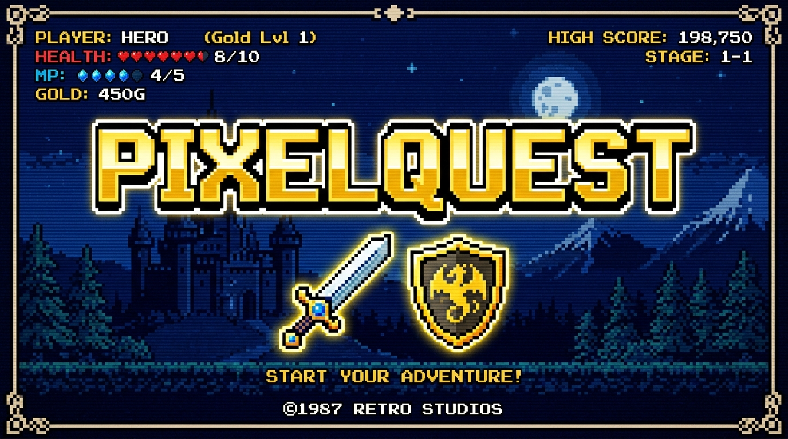

# ⚔️ PixelQuest v1.0.0 — Level Up Your Life



**PixelQuest** is a gamified daily task and habit tracker Android application built with **Kotlin** and **Jetpack Compose**. Designed with an authentic retro 8-bit arcade RPG aesthetic, PixelQuest turns real-world daily routines into engaging, rewarding quests.

---

## 🎮 Concept & Core Features

- **Gamified Quest Tracking**: Earn XP, level up your character class, maintain consecutive perfect day streaks, and unlock tier badges.
- **8-Bit Sound Engine**: Built-in 8-bit sound effects (button clicks, quest completion, missed alerts, and level-up fanfares) powered by `SoundPool` with persisted volume & mute controls.
- **Character Avatar Progression**: Choose from 6 retro class sprites (*Hero, Mage, Rogue, Warrior, Paladin, Ranger*) with dynamic level tier frames (*Bronze, Silver, Gold*).
- **Retro CRT Scanline Filter**: Optional real-time CRT scanlines and vignette overlay toggleable globally across all screens.
- **Interactive UI Kit**: Custom pixel-art buttons, panel cards, countdown timers, progress rings, and Press Start 2P 8-bit typography.
- **Analytics & Heatmap**: 90-day interactive activity calendar heatmap, per-task completion rate graphs, and streak history.
- **JSON Data Backup**: Full data export and import engine for local JSON backups and progress restoration.

---

## 📸 Visual Showcase

| Today's Dashboard | Tasks List | Activity Heatmap | Hero Profile |
|:-----------------:|:----------:|:----------------:|:------------:|
|  |  |  |  |

---

## 📥 Download & Install (Sideload APK)

1. Open the [PixelQuest GitHub Releases](https://github.com/RAZAAli901/PixelQuest/releases) page on your Android device.
2. Download the latest `app-release.apk` from the **v1.0.0** release assets.
3. Tap the downloaded `.apk` file to install.
   *(If prompted, allow "Install from Unknown Sources" in your Android system settings).*
4. Launch **PixelQuest** and begin your journey!

---

## 🛠 Tech Stack & Architecture

- **Language**: Kotlin 1.9.23 (Android SDK 34, Min SDK 24)
- **UI Framework**: Jetpack Compose (Material 3, Custom Pixel System)
- **Architecture**: MVVM + Clean Architecture + Reactive Kotlin Flows
- **Database & Di**: Room Database 2.6.1 + Dagger Hilt 2.51
- **Background Tasks**: WorkManager 2.9.0 + AlarmManager Exact Alarms
- **CI/CD**: GitHub Actions building signed release APKs & publishing GitHub Releases

---

## 🔨 Build from Source

```bash
# Clone repository
git clone https://github.com/RAZAAli901/PixelQuest.git
cd PixelQuest

# Build debug APK
./gradlew assembleDebug

# Build signed release APK
./gradlew assembleRelease
```
The compiled APK will be generated at:
`app/build/outputs/apk/release/app-release.apk`

---

## 📜 License
Distributed under the **MIT License**. See [`LICENSE`](LICENSE) for more details.
<!-- Reconciled against verified v1.0.0 release state -->
