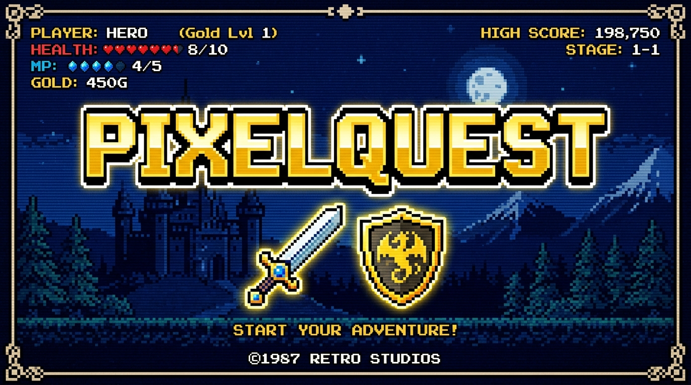

# ⚔️ PixelQuest v1.1.0 — Level Up Your Life

[](https://github.com/RAZAAli901/PixelQuest/releases/latest/download/app-release.apk)
[](https://github.com/RAZAAli901/PixelQuest/releases)
[](https://github.com/RAZAAli901/PixelQuest/releases/tag/v1.1.0)
[](LICENSE)


**PixelQuest** is a gamified daily task and habit tracker Android application built with **Kotlin** and **Jetpack Compose**. Designed with an authentic retro 8-bit arcade RPG aesthetic, PixelQuest turns real-world daily routines into engaging, rewarding quests.

---

## ⚡ Direct Download

Click the button below to directly download the latest signed release APK onto your Android device:

👉 **[📥 Direct Download app-release.apk (v1.1.0)](https://github.com/RAZAAli901/PixelQuest/releases/latest/download/app-release.apk)** 👈

Or browse all build assets and previous versions on the **[📦 GitHub Releases Page](https://github.com/RAZAAli901/PixelQuest/releases)**.

---

## 📥 Download & Installation Guide

### Option 1: Direct Download (Recommended)
1. Open this repository on your Android phone or tablet.
2. Tap **[Download app-release.apk](https://github.com/RAZAAli901/PixelQuest/releases/latest/download/app-release.apk)** to download the file directly.
3. Open your device's **Downloads** folder and tap `app-release.apk`.
4. If prompted, select **Allow from this source** to grant permission for sideloading unknown apps.
5. Tap **Install**, open **PixelQuest**, and begin your journey!

### Option 2: Via GitHub Releases Page
1. Visit the **[PixelQuest GitHub Releases](https://github.com/RAZAAli901/PixelQuest/releases)** page.
2. Under **Assets** for the latest release, click on **`app-release.apk`**.
3. Install and launch the application on your Android device.

---

## 🎮 Concept & Core Features

- **Gamified Quest Tracking**: Earn XP, level up your character class, maintain consecutive perfect day streaks, and unlock tier badges.
- **8-Bit Sound Engine**: Built-in 8-bit sound effects (button clicks, quest completion, missed alerts, and level-up fanfares) powered by `SoundPool` with persisted volume & mute controls.
- **Character Avatar Progression**: Choose from 6 retro class sprites (*Hero, Mage, Rogue, Warrior, Paladin, Ranger*) with dynamic level tier frames (*Bronze, Silver, Gold*).
- **Retro CRT Scanline Filter**: Optional real-time CRT scanlines and vignette overlay toggleable globally across all screens.
- **Interactive UI Kit**: Custom pixel-art buttons, panel cards, countdown timers, progress rings, and Press Start 2P 8-bit typography.
- **Analytics & Heatmap**: 90-day interactive activity calendar heatmap, per-task completion rate graphs, and streak history.
- **JSON Data Backup**: Full data export and import engine for local JSON backups and progress restoration.

---

## 📸 Visual Showcase

| Today's Dashboard | Tasks List | Activity Heatmap | Hero Profile |
|:-----------------:|:----------:|:----------------:|:------------:|
|  |  |  |  |

---

## 🛠 Tech Stack & Architecture

- **Language**: Kotlin 1.9.23 (Android SDK 34, Min SDK 24)
- **UI Framework**: Jetpack Compose (Material 3, Custom Pixel System)
- **Architecture**: MVVM + Clean Architecture + Reactive Kotlin Flows
- **Database & DI**: Room Database 2.6.1 + Dagger Hilt 2.51
- **Background Tasks**: WorkManager 2.9.0 + AlarmManager Exact Alarms
- **CI/CD**: GitHub Actions building signed release APKs & publishing GitHub Releases

---

## 🔨 Build from Source

```bash
# Clone repository
git clone https://github.com/RAZAAli901/PixelQuest.git
cd PixelQuest

# Build debug APK
./gradlew assembleDebug

# Build signed release APK
./gradlew assembleRelease
```
The compiled APK will be generated at:
`app/build/outputs/apk/release/app-release.apk`

### Optional settings (`local.properties`, never committed)

To set up sign-in, the leaderboard and the AI Coach from scratch (Supabase project, email and Google sign-in, the AI server, GitHub secrets), follow [docs/CLOUD_SETUP.md](docs/CLOUD_SETUP.md).

| Setting | Used for |
| --- | --- |
| `SUPABASE_URL`, `SUPABASE_ANON_KEY` | Sign-in (by email code, and Google), cloud sync, the leaderboard and the AI Coach, which is for signed-in players. Without them the app is fully playable offline. |
| `GOOGLE_WEB_CLIENT_ID` | The Sign in with Google button (the Web client ID). Without it, players sign in by email. |
| `GEMINI_API_KEY` | The AI Coach in **debug** builds only (still only while signed in). Release builds never contain it; they reach Gemini through the `gemini-proxy` Supabase Edge Function, which holds the key ([docs/GEMINI_PROXY.md](docs/GEMINI_PROXY.md)). Add `GEMINI_VIA_PROXY=true` to make a debug build use the proxy too. |
| `KEYSTORE_FILE`, `KEYSTORE_PASSWORD`, `KEY_ALIAS`, `KEY_PASSWORD` | Signing release builds with your own key (or set them as environment variables). Without them, release builds are signed with the debug key. |

### Tests

```bash
./gradlew testDebugUnitTest
```

```bash
node --test "supabase/functions/**/*.test.ts"
```

CI runs both on every push. Unit tests never call the live Gemini API; `GeminiConnectivitySmokeTest` makes a live call only when `PIXELQUEST_LIVE_GEMINI=1` is set.

---

## 🛡️ Real-Device Verification Status

This release has undergone an extensive 39-step verification pass post-release:
- **Verified Build Artifact**: Published v1.0.3 GitHub Release signed APK sideloaded and tested on a clean environment.
- **Pass/Fail Results**: 100% pass rate across Onboarding, Task Creation, Alarm Notifications, Streaks & XP, 90-day Stats Heatmap, Audio/Shader Settings, SAF JSON Export/Import, and Progress Reset flows.
- **Total Confirmed Commits**: 614 commits across initial 12-day development and post-release verification audit.

---

## 🔒 Privacy & Data Architecture

PixelQuest is built with a **local-first, privacy-respecting philosophy**:
- **Local-Only by Default**: 100% of your daily habits, scheduled times, recurrence rules, completion logs, and streak history are stored strictly on your device inside a local Room SQLite database.
- **Zero Third-Party Trackers**: No advertising SDKs, no behavioral telemetry, and no device fingerprinting.
- **Optional Cloud Leaderboard**: You can browse the community leaderboard or participate by signing in with Google.
  - Participation is strictly **opt-in (defaults to OFF)**.
  - Only your chosen public pseudonym, player level, streak, and XP are synchronized when opted in.
  - Individual quest titles, schedules, and Google email addresses are **never** uploaded or exposed.
- **Full Erasure Control**: Players can opt out at any time to instantly vanish from public rankings, or permanently purge their cloud account and data with one tap via **Settings > Cloud & Leaderboard > Delete My Cloud Data**.

For complete technical and security details, see [`PRIVACY.md`](PRIVACY.md).

---

## 📜 License
Distributed under the **MIT License**. See [`LICENSE`](LICENSE) for more details.
